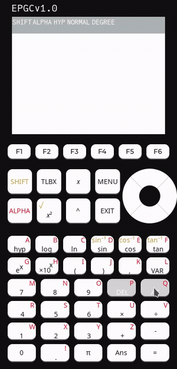

<p align="center">
  
</p>

# Expandable Programmable Graphing Calculator v1.0

[](#)
[](https://github.com/ramez-hammad/EPGC10/actions/workflows/ci.yml)

[](LICENSE)

### ▶ [Try it in your browser](https://ramez-hammad.github.io) — no install, no hardware

<p align="center">
  
</p>

## What this is

A graphing calculator built from scratch: a hand-written expression interpreter
(lexer → recursive-descent parser → evaluator) driving an LVGL user interface,
running either on an ESP32 with a 240x320 ILI9341 display or as a desktop
program on your PC. Both are built from the same source tree, so the calculator
you run in a window is the calculator that runs on the device.

**Features**

* The interpreter: `+ - * / ^ !`, implicit multiplication, parentheses,
  `sin cos tan`, their inverse and hyperbolic forms, `ln log sqrt abs`, `pi`,
  variables `A`–`Z`, `Ans`, and degree/radian/gradian modes.
* Graphing up to five functions at once, panned with the direction pad and
  zoomed with `+` and `-`.
* The PC simulator, which is fully usable with a mouse.

## Quick start (PC simulator)

Needs a C compiler, CMake 3.20+, and SDL2.

```bash
sudo apt install build-essential cmake libsdl2-dev   # Debian/Ubuntu

git clone --recurse-submodules https://github.com/ramez-hammad/EPGC10.git
cd EPGC10

cmake -S sim -B build-sim
cmake --build build-sim

./build-sim/ui        # the calculator
./build-sim/repl      # the interpreter alone, in your terminal
```

Already cloned without submodules? `git submodule update --init --recursive`.

Tests (they need no display and no hardware):

```bash
./build-sim/test_lexer
./build-sim/test_evaluator
```

## Firmware

Requires ESP-IDF v5.5.1:

```bash
idf.py build
idf.py -p /dev/ttyUSB0 flash monitor
```

Assembly and wiring instructions are in [docs/hardware.md](docs/hardware.md).

## Hardware


The calculator is based on the ESP32 microcontroller, it features a TFT ILI9341 Display and 54 buttons dedicated to various functions.
4AAA batteries power all electronics.

## Documentation

[docs/overview.md](docs/overview.md) is the place to start: the layering, the
port contract between the shared code and the two platforms, how a keypress
reaches the display, and the known gaps.
[docs/interpreter.md](docs/interpreter.md) and [docs/lexer.md](docs/lexer.md)
cover the expression engine.

## Repository overview

[src/core/](src/core) => The interpreter: lexer, parser, evaluator\
[src/ui/](src/ui) => Screens, keypad handling, formatting, graphing\
[src/port/](src/port) => Platform ports: the ESP32 firmware and the SDL simulator\
[sim/](sim) => CMake build for the PC simulator\
[test/](test) => Host tests for the interpreter\
[components/](components) => Contains LVGL and drivers\
[fonts/](fonts) => Contains fonts used in the UI\
[hardware/](hardware) => Contains schematics and designs\
[docs/](docs) => Documentation and pictures

## Gallery

<p align="center">
  
  
  
</p>
<p align="center"><i>Multiple plots · the function toolbox · the variable menu</i></p>

<details>
<summary><b>More screenshots</b></summary>

| | | |
|:--:|:--:|:--:|
|  |  |  |
| The menu | Default screen | Graph of sin(x) |
|  |  |  |
| An expression and its result | Implicit multiplication | Angle measure menu |
|  |  |  |
| The Ans variable | Syntax error pop-up | Invalid input pop-up |

</details>

## License

[GPL-3.0](LICENSE).
