

  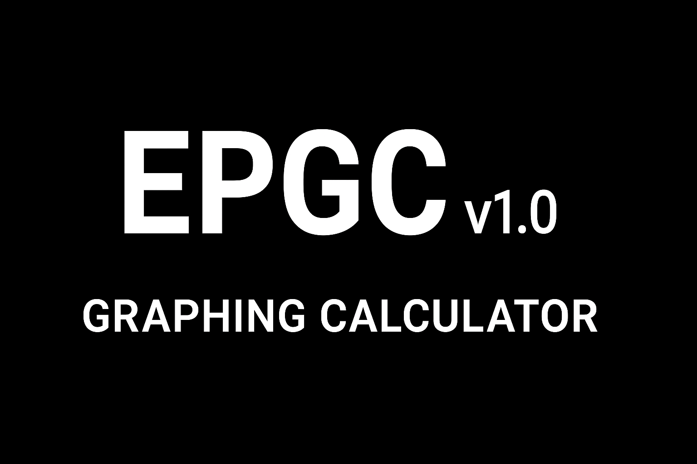

<h1 align="center">EPGCv1.0</h1>

## Expandable Programmable Graphing Calculator
### Introduction & Motivation
An open-source, expandable graphing calculator, built from the ground up. It is based on the ESP32 microcontroller. The source code is free software, it and the schematics have been released under the
GPLv3 license. My motivation for creating this calculator is for the goal of creating accessible, 
reliable education tools. Building a complete calculator -- hardware, firmware, UI, and 
interpreter, allowed me to apply everything I learned over the years into a single project. I focused on clarity, 
openness, and extensibility so that the device can evolve based on the user's desire.

## 🚀 It aims to offer:
- An alternative to commercial calculators that is less expensive and is truly yours in every way; your ability only limits customizability.
- An accessible platform to learn electronics, programming and mathematics 
- A custom, lightning fast modular mathematical expression interpreter with many built-in
  functions 
- A modern and responsive UI built using LVGL
- 2D graphing
- An experience that is designed to be fully expandable and customizable

## 🛠 Hardware
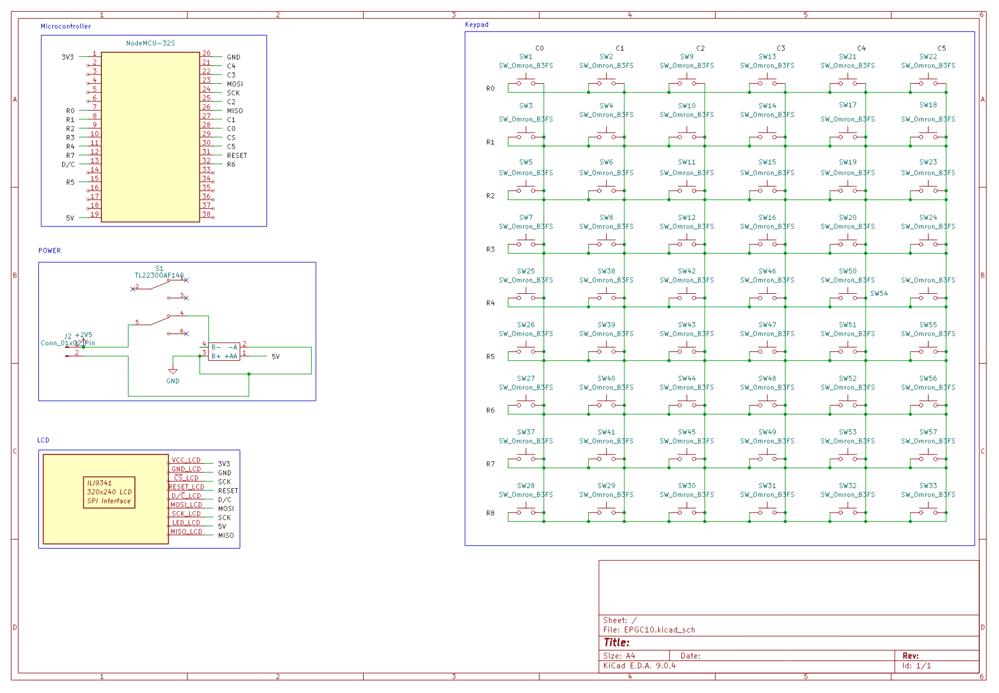

The calculator is based on the ESP32 microcontroller, it features a TFT ILI9341 Display and 54  buttons dedicated to various functions.
4AAA batteries power all electronics.

## 📦 Repository Overview
[main/](main) => Source code that includes the interpreter and the UI\
[components/](components) => Contains LVGL and drivers\
[fonts/](fonts) => Contains fonts used in the UI\
[hardware/](hardware) => Contains schematics and designs\
[docs/](docs) => Documentation and pictures

## 📜 Instructions
Assembly and firmware installation instructions can be found [here](docs/hardware.md).

## 🎥 Emulator
There exists also an emulator to allow users to have a look at the calculator before building it.

Instructions to install the PC Emulator can be found in the pc-simulator branch, otherwise a web simulator is available [here](https://ramez-hammad.github.io) 

## 📸 Gallery
Some screenshots from the calculator.
<figure>
  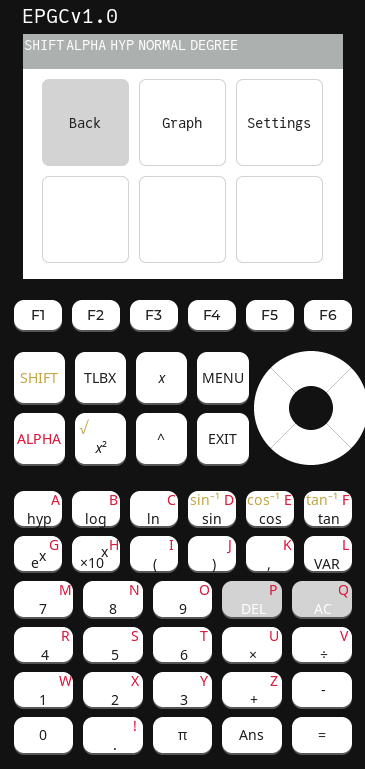
  <figcaption><b>Figure 1:</b> The menu in the simulator </figcaption>
</figure>
<figure>
  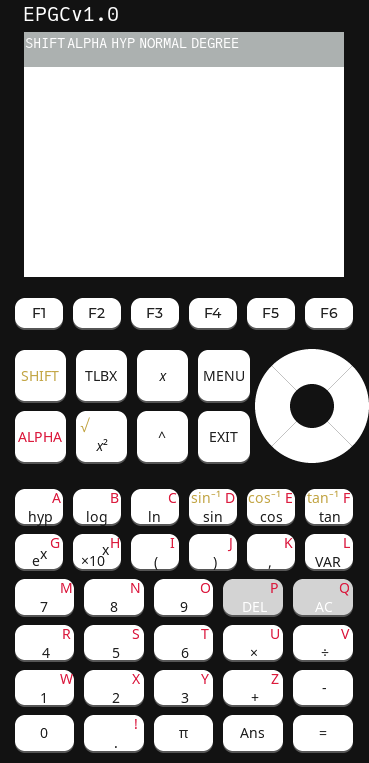
  <figcaption><b>Figure 2:</b> Default screen in the simulator </figcaption>
</figure>
<figure>
  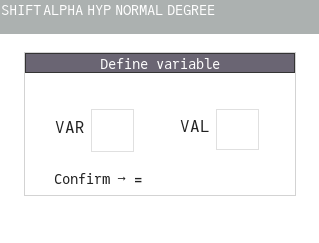
  <figcaption><b>Figure 3:</b> Variable definition menu </figcaption>
</figure>
<figure>
  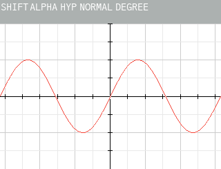
  <figcaption><b>Figure 4:</b> Graph of sin(x) </figcaption>
</figure>
<figure>
  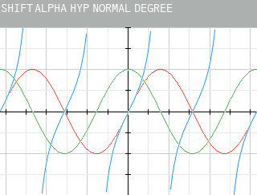
  <figcaption><b>Figure 5:</b> Graphs of sin(x), cos(x), tan(x) </figcaption>
</figure>
<figure>
  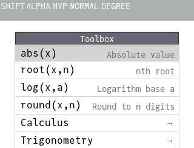
  <figcaption><b>Figure 6:</b> The function toolbox </figcaption>
</figure>
<figure>
  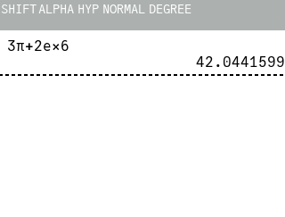
  <figcaption><b>Figure 7:</b> Sample expression with evaluation </figcaption>
</figure>
<figure>
  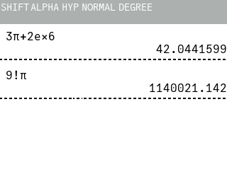
  <figcaption><b>Figure 8:</b> Demonstrating implicit multiplication </figcaption>
</figure>
<figure>
  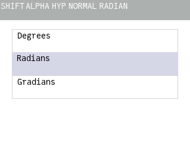
  <figcaption><b>Figure 9:</b> Angle measure menu </figcaption>
</figure>
<figure>
  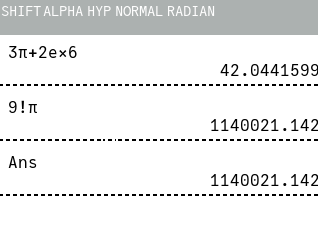
  <figcaption><b>Figure 10:</b> Ans variable showcase </figcaption>
</figure>
<figure>
  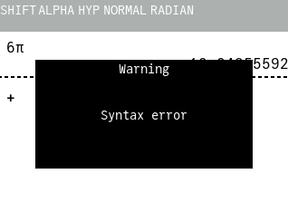
  <figcaption><b>Figure 11:</b> Syntax error pop-up </figcaption>
</figure>
<figure>
  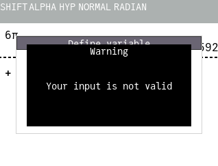
  <figcaption><b>Figure 12:</b> Invalid input pop-up </figcaption>
</figure>
